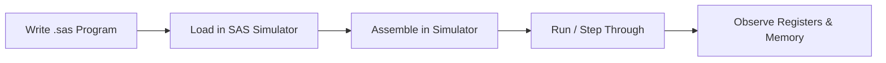

# COA Lab Programs — x86-64 NASM Assembly & SAS Simulator

> A comprehensive collection of **Computer Organization and Architecture (COA)** lab programs written in **x86-64 NASM Assembly** and **SAS (Simple Assembly Simulator)**. Covers arithmetic operations, number system conversions, string manipulation, sorting algorithms, and stack-based programs.

[](https://opensource.org/licenses/MIT)
[](https://www.nasm.us/)
[](https://en.wikipedia.org/wiki/X86-64)
[](https://github.com/SAS-Simulator)
[](#)

---

## Table of Contents

- [About](#about)
- [Programs Overview](#programs-overview)
- [Tech Stack](#tech-stack)
- [Prerequisites](#prerequisites)
- [Installation & Setup](#installation--setup)
- [Usage Guide](#usage-guide)
- [Program Details](#program-details)
- [Folder Structure](#folder-structure)
- [Architecture & Workflow](#architecture--workflow)
- [Contributing](#contributing)
- [License](#license)
- [Author](#author)

---

## About

This repository contains all **COA (Computer Organization and Architecture)** lab programs developed as part of the B.E./B.Tech Computer Science Engineering curriculum. The programs are written in two environments:

1. **x86-64 NASM Assembly** — Programs that run natively on 64-bit Linux systems using Linux syscalls for I/O.
2. **SAS (Simple Assembly Simulator)** — Programs designed to run on the SAS educational simulator, ideal for learning basic assembly concepts.

### Why This Repository Exists

Understanding low-level programming is fundamental to Computer Science. This repository bridges the gap between theoretical COA concepts and practical implementation, offering students ready-to-study, well-commented assembly programs covering all standard lab experiments.

---

## Programs Overview

| # | Filename | Description |
|---|----------|-------------|
| 1 | `3_AD.asm` | 64-bit Addition and Division of two numbers |
| 2 | `4_MS.asm` | 64-bit Multiplication and Subtraction |
| 3 | `5_HB.asm` | Convert 64-bit Hexadecimal number to BCD |
| 4 | `6_BH.asm` | Convert BCD number to Hexadecimal |
| 5 | `7_SA.asm` | String/Array operations in assembly |
| 6 | `8_AS.asm` | ASCII and string manipulation |
| 7 | `9_SCSP.asm` | Stack operations using push/pop (SP-based) |
| 8 | `10_SCSC.asm` | Menu-driven string operations (copy, concat, reverse, palindrome check) |
| 9 | `11_SRSP.asm` | String reversal and palindrome detection |
| 10 | `add.sas` | Addition program for SAS simulator |
| 11 | `SUB.sas` | Subtraction program for SAS simulator |
| 12 | `INC.sas` | Increment operation for SAS simulator |
| 13 | `DEC.sas` | Decrement operation for SAS simulator |
| 14 | `SUCADD.sas` | Successive addition (multiplication by repeated addition) |
| 15 | `mul_input.sas` | Multiplication with user input for SAS simulator |

---

## Tech Stack

### Assembly Language
- **NASM (Netwide Assembler)** — x86-64 assembly language, used for all `.asm` programs
- **Linux syscalls** — Direct system calls for I/O (`sys_read`, `sys_write`, `sys_exit`)
- **x86-64 architecture** — 64-bit registers (RAX, RBX, RCX, RDX, RSI, RDI, RSP)

### Simulator
- **SAS (Simple Assembly Simulator)** — Educational simulator for learning basic assembly concepts
- Used for `.sas` programs: ADD, SUB, INC, DEC, and MUL operations

### Tools
- **GCC / LD** — Linker for creating executables from object files
- **GDB** — GNU Debugger for step-by-step debugging
- **Linux Terminal** — Runtime environment for x86-64 programs

---

## Prerequisites

### For NASM Programs (`.asm` files)
- Linux (Ubuntu 18.04+ or any 64-bit Linux distribution)
- NASM assembler (`nasm`)
- GNU Linker (`ld`)

```bash
# Install NASM on Ubuntu/Debian
sudo apt update
sudo apt install nasm
```

### For SAS Programs (`.sas` files)
- SAS Simple Assembly Simulator installed
- Java Runtime Environment (JRE) — required by most SAS simulator versions

---

## Installation & Setup

### Clone the Repository

```bash
git clone https://github.com/tusharkkp/COA.git
cd COA
```

### Assemble and Run a NASM Program

```bash
# Step 1: Assemble the source file into an object file
nasm -f elf64 3_AD.asm -o 3_AD.o

# Step 2: Link the object file to create an executable
ld -o 3_AD 3_AD.o

# Step 3: Run the executable
./3_AD
```

### Run a SAS Program

1. Open the SAS Simulator application.
2. Load the `.sas` file (e.g., `add.sas`).
3. Click **Assemble**, then **Run** or **Step** to execute.

---

## Usage Guide

### NASM Programs Workflow


### SAS Simulator Workflow



---

## Program Details

### NASM Assembly Programs

#### `3_AD.asm` — 64-bit Addition and Division
- Accepts two 64-bit integers from the user
- Performs **addition** and **integer division**
- Displays results using Linux write syscall
- Uses macros `WRITE` and `READ` for I/O

#### `4_MS.asm` — 64-bit Multiplication and Subtraction
- Accepts two 64-bit numbers
- Performs **multiplication** (using `mul`/`imul`) and **subtraction**
- Handles signed/unsigned arithmetic

#### `5_HB.asm` — Hexadecimal to BCD Conversion
- Accepts a 64-bit hexadecimal number
- Converts it to **Binary Coded Decimal (BCD)** format
- Uses divide-by-10 loop to extract BCD digits

#### `6_BH.asm` — BCD to Hexadecimal Conversion
- Reverse of `5_HB.asm`
- Reads a BCD-formatted number and converts to hex representation

#### `7_SA.asm` — String and Array Operations
- Demonstrates string traversal, length calculation, and array manipulation in assembly

#### `8_AS.asm` — ASCII and String Manipulation
- ASCII character operations, case conversion, and string processing

#### `9_SCSP.asm` — Stack Operations
- Demonstrates **push**, **pop**, **stack pointer (SP)** manipulation
- Stack-based computation and memory access patterns

#### `10_SCSC.asm` — Menu-Driven String Operations
- Interactive menu with options for:
  - String Copy
  - String Concatenation
  - String Reverse
  - Palindrome Check
- Uses conditional jumps and loop constructs

#### `11_SRSP.asm` — String Reversal and Palindrome Detection
- Reverses a given string in place
- Detects whether a string is a palindrome using two-pointer technique

### SAS Simulator Programs

| File | Operation | Description |
|------|-----------|-------------|
| `add.sas` | ADD | Adds two numbers stored in memory |
| `SUB.sas` | SUB | Subtracts second operand from first |
| `INC.sas` | INC | Increments a register/memory value |
| `DEC.sas` | DEC | Decrements a register/memory value |
| `SUCADD.sas` | MUL via ADD | Implements multiplication through successive addition |
| `mul_input.sas` | MUL | Multiplication with user-provided inputs |

---

## Folder Structure

```
COA/
├── 3_AD.asm          # 64-bit Addition and Division
├── 4_MS.asm          # 64-bit Multiplication and Subtraction
├── 5_HB.asm          # Hexadecimal to BCD conversion
├── 6_BH.asm          # BCD to Hexadecimal conversion
├── 7_SA.asm          # String and Array operations
├── 8_AS.asm          # ASCII and String manipulation
├── 9_SCSP.asm        # Stack operations (SP-based)
├── 10_SCSC.asm       # Menu-driven string operations
├── 11_SRSP.asm       # String reversal and palindrome check
├── add.sas           # SAS: Addition
├── SUB.sas           # SAS: Subtraction
├── INC.sas           # SAS: Increment
├── DEC.sas           # SAS: Decrement
├── SUCADD.sas        # SAS: Successive addition (multiplication)
├── mul_input.sas     # SAS: Multiplication with input
├── README.md         # Project documentation
├── CONTRIBUTING.md   # Contribution guidelines
└── LICENSE           # MIT License
```

---

## Architecture & Workflow

### x86-64 NASM Program Structure

```
┌─────────────────────────────────────────────┐
│              NASM Program Structure          │
├─────────────────────────────────────────────┤
│  section .data    → Initialized data/strings │
│  section .bss     → Uninitialized buffers    │
│  section .text    → Program instructions     │
│    global _start  → Entry point              │
│    _start:        → Main execution begins    │
└─────────────────────────────────────────────┘
```

### Linux Syscall Interface Used

| Syscall | Number | Usage |
|---------|--------|-------|
| sys_read | 0 | Read input from stdin |
| sys_write | 1 | Write output to stdout |
| sys_exit | 60 | Terminate program |

### Key x86-64 Registers Used

| Register | Purpose |
|----------|---------|
| RAX | Accumulator / syscall number |
| RBX | Base register |
| RCX | Counter (loop iterations) |
| RDX | Data / syscall size |
| RSI | Source index / buffer pointer |
| RDI | Destination index / file descriptor |
| RSP | Stack pointer |
| RBP | Base pointer |

---

## Concepts Covered

This repository demonstrates the following COA concepts:

- **Arithmetic operations** — addition, subtraction, multiplication, division using x86-64 instructions
- **Number system conversions** — hexadecimal to BCD and BCD to hexadecimal
- **Memory and addressing** — direct, register-indirect, and immediate addressing modes
- **String processing** — assembly-level string copy, reverse, comparison, and palindrome detection
- **Stack operations** — push/pop mechanics, stack frame setup, SP manipulation
- **Sorting algorithms** — bubble sort or selection sort implemented in assembly
- **I/O via Linux syscalls** — reading from stdin and writing to stdout without standard libraries
- **Macros in NASM** — defining reusable READ/WRITE macros to simplify I/O code
- **Conditional branching** — `cmp`, `je`, `jne`, `jl`, `jg`, `loop` instructions
- **SAS Simulator fundamentals** — basic machine-level operations: ADD, SUB, INC, DEC, MUL

---

## Performance & Scalability

These programs are designed as **educational lab exercises** focused on clarity and correctness. Key characteristics:

- **Direct hardware interaction** — No OS abstraction overhead; programs communicate directly with the Linux kernel via syscalls
- **Minimal memory footprint** — Each program uses only the registers and stack space it needs
- **Reusable I/O macros** — The `%macro WRITE` and `%macro READ` patterns in NASM programs reduce code duplication
- **Modular design** — Each file is a self-contained program covering exactly one lab experiment

---

## Future Scope

- [ ] Add Makefile for automated build and clean of all NASM programs
- [ ] Port SAS programs to EMU8086 format for wider simulator compatibility
- [ ] Add 8085/8086 assembly programs for microprocessor lab coverage
- [ ] Include sample input/output for each program
- [ ] Add GDB debugging walkthrough for stack operation programs
- [ ] Create a unified runner script (`run.sh`) for batch assembly and execution
- [ ] Add programs for: floating-point operations, interrupt handling, segment registers

---

## Contributing

Contributions are welcome! Please read [CONTRIBUTING.md](CONTRIBUTING.md) before submitting a pull request.

1. Fork the repository
2. Create your feature branch: `git checkout -b feature/add-new-program`
3. Commit your changes: `git commit -m "Add: 8086 bubble sort program"`
4. Push to the branch: `git push origin feature/add-new-program`
5. Open a Pull Request

---

## License

This project is licensed under the **MIT License** — see the [LICENSE](LICENSE) file for details.

---

## Author

**Tushar Kaldate**

- GitHub: [@tusharkkp](https://github.com/tusharkkp)
- LinkedIn: [Tushar Kaldate](https://www.linkedin.com/in/tushar-kaldate-2b5276262/)

---

## Acknowledgements

- NASM documentation and the x86-64 Linux ABI specification
- SAS Simulator developers for the educational assembly environment
- Computer Science faculty for designing these lab experiments

---

*If this repository helped you, please consider giving it a star! It helps others discover these resources.*
